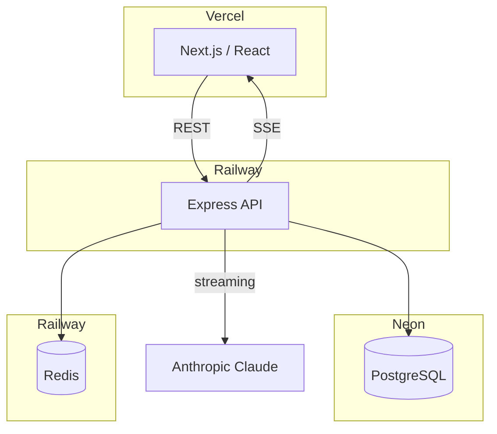
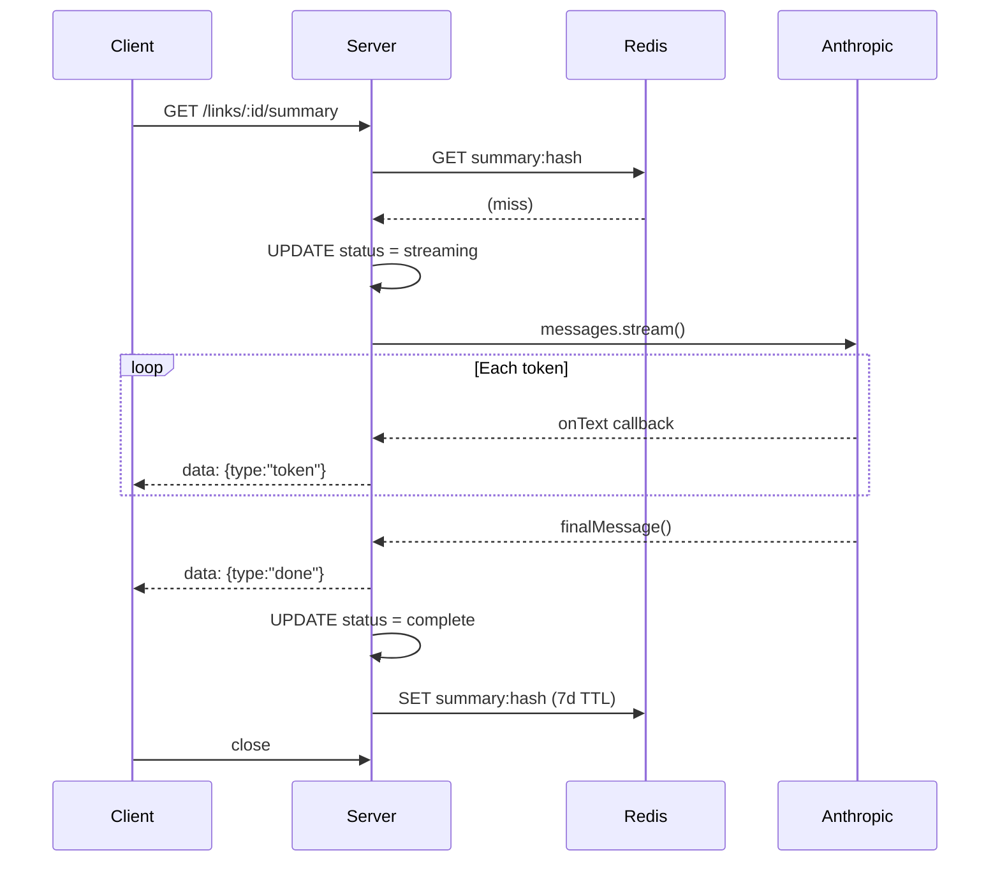
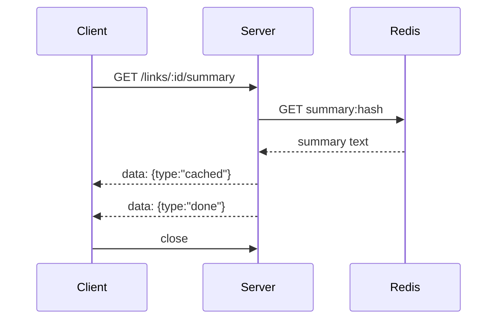
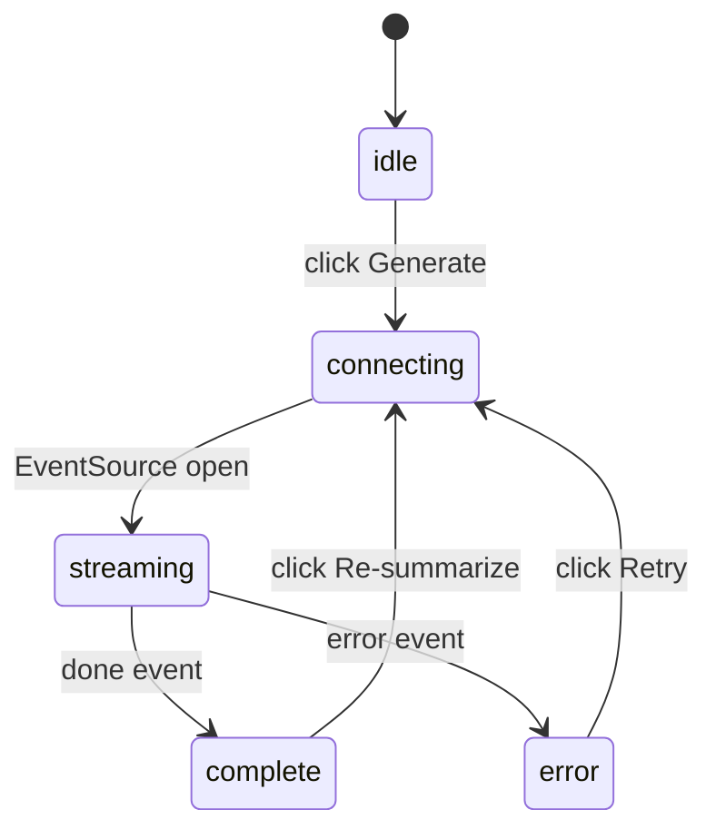
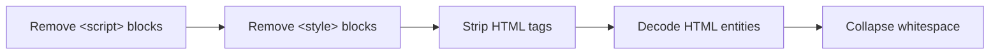
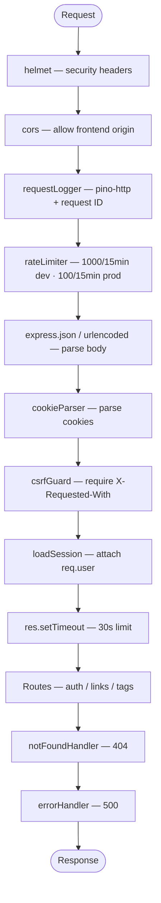

# Link Saver AI — Technical Overview

## Table of Contents

1. [Project Context](#1-project-context)
2. [Architecture Overview](#2-architecture-overview)
3. [Tech Stack](#3-tech-stack)
4. [Package Inventory](#4-package-inventory)
5. [Repository Structure](#5-repository-structure)
6. [Database Schema](#6-database-schema)
7. [API Reference](#7-api-reference)
8. [System Design Deep Dives](#8-system-design-deep-dives)
   - [SSE Streaming](#81-sse-streaming)
   - [Redis Caching](#82-redis-caching)
   - [Authentication](#83-authentication)
   - [Content Extraction](#84-content-extraction)
9. [Middleware Stack](#9-middleware-stack)
10. [Frontend Architecture](#10-frontend-architecture)
11. [Deployment](#11-deployment)
12. [Architectural Decisions](#12-architectural-decisions)

---

## 1. Project Context

This is App 2 in a portfolio of eight progressive full-stack AI applications. Its primary purpose is to demonstrate **Server-Sent Events (SSE) streaming** from the Anthropic Claude API — a pattern reused in Apps 4, 7, and 8. It also introduces Redis caching as a first-class concern.

The application is a production-grade bookmark manager where saved URLs are automatically fetched and summarized by an LLM in real time.

---

## 2. Architecture Overview



**Deployment targets:**

- Frontend → Vercel (Next.js serverless)
- API server → Railway (Docker container)
- Database → Neon (serverless PostgreSQL)
- Cache → Railway (Redis service)

---

## 3. Tech Stack

| Layer                  | Technology       | Version                  | Notes                                   |
| ---------------------- | ---------------- | ------------------------ | --------------------------------------- |
| **Frontend framework** | Next.js          | 15.x                     | App Router, no Pages Router             |
| **UI library**         | React            | 19.x                     | Concurrent features, Suspense           |
| **Language**           | TypeScript       | 5.x                      | Strict mode, `noUncheckedIndexedAccess` |
| **API server**         | Express          | 5.x                      | Async error propagation built-in        |
| **Runtime**            | Node.js          | ≥ 22.0                   | Required by both packages               |
| **Database**           | PostgreSQL       | 13+                      | Hosted on Neon (serverless)             |
| **Cache**              | Redis            | —                        | Hosted on Railway, via ioredis          |
| **LLM**                | Anthropic Claude | claude-sonnet-4-20250514 | Streaming SDK                           |
| **Auth**               | Custom sessions  | —                        | bcrypt + HTTP-only cookies              |
| **Logging**            | Pino             | 10.x                     | JSON in prod, pino-pretty in dev        |
| **Validation**         | Zod              | 4.x                      | Schemas for all request bodies          |
| **Testing**            | Vitest           | 3.x                      | Unit + integration, supertest           |
| **Package manager**    | pnpm             | 9.x                      | Workspaces monorepo                     |
| **Container**          | Docker           | —                        | Multi-stage build for production        |

---

## 4. Package Inventory

### Server

**Runtime dependencies:**

| Package                        | Purpose                                                                                                           |
| ------------------------------ | ----------------------------------------------------------------------------------------------------------------- |
| `@anthropic-ai/sdk`            | Streaming Claude API calls with AbortController support                                                           |
| `@extractus/article-extractor` | Extracts clean article text from URLs (primary content fetcher)                                                   |
| `@google-cloud/secret-manager` | Fetches secrets from GCP Secret Manager in production                                                             |
| `bcrypt`                       | Password hashing with 12 salt rounds                                                                              |
| `cookie-parser`                | Parses HTTP cookies into `req.cookies`                                                                            |
| `cors`                         | Cross-origin resource sharing middleware                                                                          |
| `dotenv`                       | Loads `.env` file into `process.env`                                                                              |
| `express`                      | HTTP framework (v5 — async errors propagated automatically)                                                       |
| `express-rate-limit`           | In-memory rate limiting; global (1000 dev / 100 prod per 15 min) and auth-specific (100 dev / 10 prod per 15 min) |
| `helmet`                       | Sets security headers (XSS, clickjacking, MIME sniffing protection)                                               |
| `ioredis`                      | Redis client with auto-reconnect and pipeline support                                                             |
| `node-pg-migrate`              | Database migrations in JS                                                                                         |
| `pg`                           | PostgreSQL client and connection pool                                                                             |
| `pino`                         | Structured JSON logger                                                                                            |
| `pino-http`                    | HTTP request/response logging middleware                                                                          |
| `zod`                          | Runtime schema validation for all request bodies                                                                  |

**Dev dependencies:**

| Package                  | Purpose                                            |
| ------------------------ | -------------------------------------------------- |
| `tsx`                    | TypeScript execution for development (`tsx watch`) |
| `tsc-alias`              | Resolves path aliases after `tsc` compilation      |
| `vitest`                 | Test runner                                        |
| `supertest`              | HTTP assertion library for integration tests       |
| `pino-pretty`            | Human-readable log formatting in development       |
| `eslint-plugin-security` | Security-focused ESLint rules                      |
| `lefthook`               | Git hook runner (pre-commit lint + format check)   |

### Web Client

| Package                  | Purpose                                               |
| ------------------------ | ----------------------------------------------------- |
| `next`                   | React framework with App Router and SSR               |
| `react` / `react-dom`    | UI library                                            |
| `@tanstack/react-query`  | Server state management, caching, and synchronization |
| `@vercel/analytics`      | Page view and event tracking                          |
| `@vercel/speed-insights` | Core Web Vitals monitoring                            |
| `sass`                   | SCSS compilation for global styles                    |

---

## 5. Repository Structure

This is a pnpm monorepo with two workspace packages: `server` and `web-client`.

```
link-saver-ai-summarizer/
├── package.json                    # Workspace root (pnpm --parallel run dev)
├── pnpm-workspace.yaml             # Declares server/ and web-client/ as packages
├── pnpm-lock.yaml
├── Dockerfile.server               # Multi-stage Docker build for the API server
├── railway.toml                    # Railway deploy config (health checks, restart policy)
├── lefthook.yml                    # Pre-commit hooks
│
├── server/
│   ├── package.json
│   ├── tsconfig.json               # paths: { "app/*": ["src/*"] }
│   ├── .env                        # Local environment variables
│   ├── migrations/                 # node-pg-migrate JS migration files
│   │   ├── ..._create-users-table.js
│   │   ├── ..._create-sessions-table.js
│   │   ├── ..._create-links-table.js
│   │   ├── ..._create-tags-table.js
│   │   └── ..._create-link-tags-table.js
│   └── src/
│       ├── index.ts                # Entry point: load secrets → load .env → startServer()
│       ├── app.ts                  # Express app: middleware stack, route mounting
│       ├── config/
│       │   ├── corsConfig.ts       # CORS origin, methods, headers, maxAge
│       │   ├── env.ts              # isProduction() helper
│       │   ├── redis.ts            # Redis singleton (lazy init, graceful failure)
│       │   └── secrets.ts          # GCP Secret Manager integration (prod only)
│       ├── constants/
│       │   └── session.ts          # SESSION_COOKIE_NAME = 'sid', SESSION_TTL_MS = 30d
│       ├── db/
│       │   └── pool/
│       │       └── pool.ts         # pg.Pool config, query() wrapper, withTransaction()
│       ├── handlers/
│       │   ├── auth/auth.ts        # register, login, logout, me
│       │   ├── links/
│       │   │   ├── links.ts        # create, list, getById, update, remove
│       │   │   ├── summary.ts      # streamLinkSummary (SSE), resummarize
│       │   │   └── link-tags.ts    # addTag, listTags, removeTag
│       │   └── tags/tags.ts        # create, list, getById, update, remove
│       ├── middleware/
│       │   ├── csrfGuard/          # Requires X-Requested-With on state-changing requests
│       │   ├── errorHandler/       # Centralized 500 response; stack trace in dev
│       │   ├── notFoundHandler/    # 404 JSON response
│       │   ├── rateLimiter/        # Global + auth-specific rate limits
│       │   ├── requestLogger/      # pino-http with request ID generation
│       │   ├── requireAuth/        # loadSession (all routes), requireAuth (protected routes)
│       │   └── summarizeRateLimit/ # Per-user Redis INCR rate limit (20/hr)
│       ├── prompts/
│       │   └── summarize.ts        # SUMMARIZE_SYSTEM_PROMPT + buildSummarizeUserPrompt()
│       ├── repositories/
│       │   ├── auth/auth.ts        # createUser, findUserByEmail, session CRUD
│       │   ├── links/links.ts      # Link CRUD + full-text search query
│       │   ├── tags/tags.ts        # Tag CRUD
│       │   └── link-tags/          # Junction table operations
│       ├── routes/
│       │   ├── auth.ts             # Mounts auth handlers with authRateLimiter
│       │   ├── links.ts            # Mounts link + summary + link-tag handlers
│       │   └── tags.ts             # Mounts tag handlers
│       ├── schemas/
│       │   ├── auth.ts             # registerSchema, loginSchema (Zod)
│       │   ├── links.ts            # createLinkSchema, updateLinkSchema
│       │   └── tags.ts             # createTagSchema, updateTagSchema
│       ├── services/
│       │   ├── anthropic.ts        # streamSummary() — wraps SDK streaming with callbacks
│       │   ├── content-fetcher.ts  # fetchContent() — article extraction with fallback
│       │   └── summary-cache.ts    # getCachedSummary(), cacheSummary(), bustCache()
│       ├── types/
│       │   └── express.d.ts        # Extends Request with `user?: User`
│       └── utils/
│           ├── logs/logger.ts      # Pino instance (pino-pretty in dev, JSON in prod)
│           └── parsers/            # parseIdParam(), parsePagination()
│
└── web-client/
    ├── package.json
    └── src/
        ├── app/
        │   ├── layout.tsx          # Root layout: AuthProvider + QueryProvider
        │   └── page.tsx            # Dashboard: link list, tag manager, streaming detail
        ├── components/
        │   ├── AuthForm.tsx        # Login/register form with mode toggle
        │   ├── LinkForm.tsx        # URL submission form
        │   ├── StreamingSummary.tsx # SSE client, status machine, token accumulator
        │   └── TagManager.tsx      # Tag CRUD, assignment, and filter controls
        ├── lib/
        │   ├── api.ts              # apiFetch() wrapper with X-Requested-With + credential headers
        │   └── auth.tsx            # AuthContext, AuthProvider, useAuth() hook
        └── providers/
            └── QueryProvider.tsx   # TanStack Query client configuration
```

---

## 6. Database Schema

The database has five tables. All primary keys are UUIDs generated by PostgreSQL. Foreign keys use `ON DELETE CASCADE` throughout, so deleting a user removes all their data, and deleting a tag removes its junction table entries.

### `users`

```sql
CREATE TABLE users (
  id           UUID        PRIMARY KEY DEFAULT gen_random_uuid(),
  email        TEXT        NOT NULL UNIQUE,
  password_hash TEXT       NOT NULL,
  created_at   TIMESTAMPTZ DEFAULT NOW(),
  updated_at   TIMESTAMPTZ DEFAULT NOW()
);
-- Trigger: automatically sets updated_at on every UPDATE
```

### `sessions`

```sql
CREATE TABLE sessions (
  id         TEXT        PRIMARY KEY,    -- SHA256 hash of the raw session token
  user_id    UUID        NOT NULL REFERENCES users ON DELETE CASCADE,
  expires_at TIMESTAMPTZ NOT NULL,
  created_at TIMESTAMPTZ DEFAULT NOW()
);
CREATE INDEX ON sessions (user_id);
CREATE INDEX ON sessions (expires_at);
```

The raw token is stored in the cookie; only its SHA256 hash is stored in the database. A compromised database cannot be used to impersonate sessions.

### `links`

```sql
CREATE TABLE links (
  id              UUID        PRIMARY KEY DEFAULT gen_random_uuid(),
  user_id         UUID        NOT NULL REFERENCES users ON DELETE CASCADE,
  url             TEXT        NOT NULL,
  url_hash        TEXT        NOT NULL,   -- SHA256(url) — used as Redis cache key
  title           TEXT,
  domain          TEXT,
  summary         TEXT,                   -- NULL until generated
  summary_status  TEXT        NOT NULL DEFAULT 'pending',
                                          -- pending | streaming | complete | failed
  fetched_content TEXT,                   -- Cleaned article text sent to Claude
  created_at      TIMESTAMPTZ DEFAULT NOW(),
  updated_at      TIMESTAMPTZ DEFAULT NOW()
);
CREATE INDEX ON links (user_id);
CREATE INDEX ON links (url_hash);
CREATE INDEX ON links (summary_status);
-- Trigger: automatically sets updated_at on every UPDATE
```

### `tags`

```sql
CREATE TABLE tags (
  id         UUID        PRIMARY KEY DEFAULT gen_random_uuid(),
  user_id    UUID        NOT NULL REFERENCES users ON DELETE CASCADE,
  name       TEXT        NOT NULL,
  color      TEXT        DEFAULT '#6366f1',
  created_at TIMESTAMPTZ DEFAULT NOW(),
  UNIQUE (user_id, name)   -- No duplicate tag names within a user's account
);
CREATE INDEX ON tags (user_id);
```

### `link_tags` (junction table)

```sql
CREATE TABLE link_tags (
  link_id    UUID NOT NULL REFERENCES links ON DELETE CASCADE,
  tag_id     UUID NOT NULL REFERENCES tags  ON DELETE CASCADE,
  created_at TIMESTAMPTZ DEFAULT NOW(),
  PRIMARY KEY (link_id, tag_id)
);
CREATE INDEX ON link_tags (tag_id);
```

---

## 7. API Reference

All routes require `Content-Type: application/json` and `X-Requested-With: XMLHttpRequest` on state-changing requests. Authentication uses an HTTP-only session cookie (`sid`).

### Authentication

| Method | Path             | Auth | Description                                                              |
| ------ | ---------------- | ---- | ------------------------------------------------------------------------ |
| POST   | `/auth/register` | No   | Creates user + session. Body: `{ email, password }`. Returns `{ user }`. |
| POST   | `/auth/login`    | No   | Validates credentials, creates session. Returns `{ user }`.              |
| POST   | `/auth/logout`   | No   | Deletes session from DB, clears cookie. Returns 204.                     |
| GET    | `/auth/me`       | Yes  | Returns `{ user }` for current session.                                  |

Auth routes are rate-limited at 100/15 min (dev) or 10/15 min (prod).

### Links

| Method | Path         | Auth | Description                                                  |
| ------ | ------------ | ---- | ------------------------------------------------------------ |
| POST   | `/links`     | Yes  | Creates a link. Fetches article content. Body: `{ url }`.    |
| GET    | `/links`     | Yes  | Lists all user's links. Optional `?q=` for full-text search. |
| GET    | `/links/:id` | Yes  | Returns a single link.                                       |
| PATCH  | `/links/:id` | Yes  | Updates link fields. Body: `{ title? }`.                     |
| DELETE | `/links/:id` | Yes  | Deletes link and busts its Redis cache entry. Returns 204.   |

### Summary (SSE)

| Method | Path                     | Auth | Description                                                           |
| ------ | ------------------------ | ---- | --------------------------------------------------------------------- |
| GET    | `/links/:id/summary`     | Yes  | Opens SSE stream. Returns events: `cached`, `token`, `done`, `error`. |
| POST   | `/links/:id/resummarize` | Yes  | Busts Redis cache, resets status to `pending`.                        |

SSE stream events:

```
data: {"type":"cached","summary":"..."}   // Cache hit — immediate
data: {"type":"token","token":"..."}       // Each streaming delta
data: {"type":"done","summary":"...","usage":{"inputTokens":N,"outputTokens":N}}
data: {"type":"error","message":"..."}
```

Summary endpoints are rate-limited at 20 summaries/hour per user via Redis.

### Link Tags

| Method | Path                     | Auth | Description                                 |
| ------ | ------------------------ | ---- | ------------------------------------------- |
| POST   | `/links/:id/tags`        | Yes  | Assigns a tag to a link. Body: `{ tagId }`. |
| GET    | `/links/:id/tags`        | Yes  | Lists all tags assigned to a link.          |
| DELETE | `/links/:id/tags/:tagId` | Yes  | Removes a tag from a link. Returns 204.     |

### Tags

| Method | Path        | Auth | Description                                          |
| ------ | ----------- | ---- | ---------------------------------------------------- |
| POST   | `/tags`     | Yes  | Creates a tag. Body: `{ name, color? }`.             |
| GET    | `/tags`     | Yes  | Lists all user's tags (sorted by name).              |
| GET    | `/tags/:id` | Yes  | Returns a single tag.                                |
| PATCH  | `/tags/:id` | Yes  | Updates a tag. Body: `{ name?, color? }`.            |
| DELETE | `/tags/:id` | Yes  | Deletes a tag; cascades to `link_tags`. Returns 204. |

### Health

| Method | Path            | Auth | Description                                                     |
| ------ | --------------- | ---- | --------------------------------------------------------------- |
| GET    | `/health`       | No   | Returns `{ status: "ok" }` immediately.                         |
| GET    | `/health/ready` | No   | Queries DB; returns `{ status: "ok", db: "connected" }` or 503. |

---

## 8. System Design Deep Dives

### 8.1 SSE Streaming

Server-Sent Events are used instead of WebSockets because summaries are strictly unidirectional (server → client), request-scoped, and don't require persistent bidirectional state. SSE works through proxies, supports auto-reconnect natively, and requires no handshake protocol.

**End-to-end flow:**



**Client disconnect handling:**

```typescript
const abortController = new AbortController();
req.on('close', () => abortController.abort());

// AbortController signal passed to SDK — in-flight API call is cancelled
const stream = anthropic.messages.stream({ ... }, { signal: abortController.signal });
```

If the user navigates away mid-stream, the Anthropic API call is cancelled immediately, saving tokens. The DB status is left as `streaming`; the user can regenerate on their next visit.

**Cache hit path:**



A cache hit returns instantly — no LLM call, no DB write, no token usage.

**`StreamingSummary` component state machine:**



The component tracks an `accumulated` string in a closure variable (not React state) alongside `setText`. When the `done` event fires, `onComplete(accumulated)` is called directly from the event handler — not inside a state setter — so parent state updates don't trigger React's "update during render" warning.

---

### 8.2 Redis Caching

**Summary cache:**

| Property | Value                                      |
| -------- | ------------------------------------------ |
| Key      | `summary:{sha256(url)}`                    |
| TTL      | 7 days (604,800 seconds)                   |
| Set      | After successful stream completion         |
| Read     | Before starting any LLM stream             |
| Busted   | On `/resummarize` request or link deletion |

The cache key is the SHA256 hash of the URL, not the link ID. This means the same URL will hit the same cache entry regardless of which user saved it — a foundation for eventual cross-user cache sharing.

**Per-user summary rate limiting:**

| Property       | Value                                                       |
| -------------- | ----------------------------------------------------------- |
| Key            | `ratelimit:summary:{userId}`                                |
| Limit          | 20 per hour                                                 |
| Implementation | Redis INCR + EXPIRE                                         |
| Fail-open      | Yes — if Redis is unavailable, requests are allowed through |

```typescript
const current = await redis.incr(key);
if (current === 1) await redis.expire(key, 3600);  // Set TTL on first request only
if (current > 20) {
  res.status(429).json({ error: { message: 'Rate limit exceeded' } });
  return;
}
```

**Graceful Redis degradation:**

Redis is initialized lazily on first use and treated as optional infrastructure. If `REDIS_URL` is not set, or if the Redis connection fails, all cache operations return `null` (misses) and the application continues functioning — it just pays full LLM costs on every request.

---

### 8.3 Authentication

The app uses custom session-based authentication backed by PostgreSQL. There is no third-party auth provider.

**Session token design:**

1. Server generates `crypto.randomBytes(32).toString('hex')` — a 64-character random hex string
2. The **raw token** is sent to the browser in an HTTP-only cookie
3. A **SHA256 hash** of the token is stored in the `sessions` table

This means a database breach cannot be used to hijack sessions — the attacker would have the hash but not the original token, and SHA256 is not reversible.

**Login flow:**

```typescript
// Atomically delete all existing sessions and create a new one
return withTransaction(async (client) => {
  await query('DELETE FROM sessions WHERE user_id = $1', [userId], client);
  return createSession(userId, client);
});
```

Each login invalidates all previous sessions (single-session-per-account model).

**Cookie settings:**

```typescript
{
  httpOnly: true,                                // Inaccessible to JavaScript
  secure: isProduction(),                        // HTTPS-only in production
  sameSite: isProduction() ? 'none' : 'lax',    // 'none' required for cross-domain (Vercel ↔ Railway)
  maxAge: 30 * 24 * 60 * 60 * 1000,             // 30 days
  path: '/',
}
```

`SameSite: none` is required in production because the frontend (Vercel) and API (Railway) live on different domains. In development, `lax` is used with `localhost:3000` → `localhost:3001`.

**Middleware:**

- `loadSession` — Runs on every request. If a valid `sid` cookie is present, looks up the session (checking `expires_at > NOW()`), and attaches the user to `req.user`. If the lookup fails for any reason, silently continues without a user (fail-open).
- `requireAuth` — Runs on protected routes. Returns 401 if `req.user` is not set.

---

### 8.4 Content Extraction

Before a link can be summarized, the server needs its article text. This happens during link creation and, if the content wasn't stored, when the summary is first requested.

**Primary extractor: `@extractus/article-extractor`**

Parses the page and extracts clean article body text, stripping navigation, ads, and boilerplate.

**Fallback: raw fetch + HTML stripping**

If the extractor fails (paywalled site, JavaScript-heavy SPA, etc.), the server falls back to:

```typescript
const html = await fetch(url, {
  signal: AbortSignal.timeout(15_000),
  headers: { 'User-Agent': 'LinkSaverBot/1.0' },
}).then((r) => r.text());
```

Then strips HTML manually:



**Content limit:** 100,000 characters maximum. Content is truncated before being sent to Claude to stay within reasonable token budgets and to keep latency predictable.

---

## 9. Middleware Stack

Middleware is applied in this order for every request:



**CSRF protection approach:**

Rather than stateful CSRF tokens, the app uses the `X-Requested-With` header check. Browsers cannot set custom headers in cross-site form submissions or `fetch` calls without a CORS preflight. Since the CORS policy only allows the frontend origin, any request with `X-Requested-With` present must have come from a trusted origin. The `api.ts` wrapper adds this header to every request automatically.

---

## 10. Frontend Architecture

### State Management

The app uses a hybrid approach:

- **TanStack React Query** — manages the `auth/me` session check (with `staleTime: Infinity` to avoid redundant requests)
- **React `useState`** — manages all other UI state (links, tags, selected link, filter state)

There is no global client-side store (no Redux, no Zustand). All data is fetched on load and mutated locally after successful API calls.

### Auth Context

```typescript
// AuthContext provides:
{
  user: User | null,
  loading: boolean,
  login: (email, password) => Promise<void>,
  register: (email, password) => Promise<void>,
  logout: () => Promise<void>,
}
```

`login()` and `register()` call the API and immediately update the React Query cache with `queryClient.setQueryData`, so the UI updates without a refetch.

### API Client

All requests go through `apiFetch()` in `lib/api.ts`:

```typescript
async function apiFetch<T>(
  path: string,
  options: FetchOptions = {},
): Promise<T> {
  const res = await fetch(`${API_BASE}${path}`, {
    ...init,
    headers: {
      'X-Requested-With': 'XMLHttpRequest', // CSRF guard
      ...headers,
    },
    credentials: 'include', // Send session cookie cross-origin
  });

  if (!res.ok) {
    const body = await res.json().catch(() => ({}));
    throw new Error(body?.error?.message || `Request failed: ${res.status}`);
  }

  if (res.status === 204 || res.headers.get('Content-Length') === '0') {
    return undefined as T;
  }

  return res.json();
}
```

`credentials: 'include'` is required so the browser sends the `sid` cookie on cross-origin requests to the Railway API.

### StreamingSummary Component

The component manages its own status state machine (`idle → connecting → streaming → complete | error`) and is keyed by `linkId` so React fully remounts it when a different link is selected.

To avoid the React "update during render" error, the component tracks accumulated summary text in a **closure variable** (`let accumulated = ''`) inside `startStreaming`, rather than reading from React state. The `onComplete(accumulated)` call from the `done` event handler runs in an async event callback (not during render), so the parent's `setLinks` and `setSelectedLink` calls are safely batched.

---

## 11. Deployment

### Server (Railway)

The server is containerized with a two-stage Docker build:

**Stage 1 — Build:**

- Node 22 slim base
- Install all dependencies (including dev deps for TypeScript compilation)
- Run `tsc` to compile to `dist/`
- Run `tsc-alias` to resolve path aliases in compiled JS

**Stage 2 — Production:**

- Fresh Node 22 slim base
- Install only production dependencies
- Copy `dist/` from build stage
- Copy `migrations/` (run separately, not at container start)
- Expose port 3001
- Start with `node server/dist/index.js`

```toml
# railway.toml
[build]
dockerfilePath = "Dockerfile.server"

[deploy]
healthcheckPath = "/health"
healthcheckTimeout = 30
restartPolicyType = "ON_FAILURE"
restartPolicyMaxRetries = 3
```

Railway checks `/health` after deploy to confirm the server started successfully before routing traffic.

### Frontend (Vercel)

Next.js is deployed to Vercel with zero configuration beyond setting `NEXT_PUBLIC_API_URL` to the Railway API URL. The App Router enables automatic code splitting and edge caching.

### Environment Variables

**Server (Railway):**

| Variable            | Required   | Description                                         |
| ------------------- | ---------- | --------------------------------------------------- |
| `DATABASE_URL`      | Yes        | PostgreSQL connection string (Neon pooler URL)      |
| `ANTHROPIC_API_KEY` | Yes        | Claude API key                                      |
| `CORS_ORIGIN`       | Yes (prod) | Frontend URL (e.g., `https://app.vercel.app`)       |
| `REDIS_URL`         | No         | Redis connection string; caching disabled if absent |
| `NODE_ENV`          | No         | Set to `production` on Railway                      |
| `PORT`              | No         | HTTP port (default: 3001)                           |
| `GCP_PROJECT_ID`    | No         | GCP project for Secret Manager                      |
| `GCP_SA_JSON`       | No         | GCP service account credentials JSON                |

**Web Client (Vercel):**

| Variable              | Required   | Description                                     |
| --------------------- | ---------- | ----------------------------------------------- |
| `NEXT_PUBLIC_API_URL` | Yes (prod) | API base URL (default: `http://localhost:3001`) |

### Secret Management

In production, `ANTHROPIC_API_KEY` can optionally be fetched from GCP Secret Manager at server start (via `loadSecrets()` in `index.ts`). If `GCP_SA_JSON` is not set, the server falls back to reading directly from environment variables — which is the Railway-native approach.

---

## 12. Architectural Decisions

### Express 5 over Express 4

Express 5 automatically catches errors thrown in async route handlers and passes them to the error-handling middleware. This eliminates the need for try/catch in every handler or a third-party package like `express-async-errors`. All handlers can throw normally and rely on the centralized `errorHandler`.

### Layered Architecture (Routes → Handlers → Services → Repositories)

Each layer has a single responsibility:

- **Routes** — Define URL patterns, apply middleware (rate limiters, auth guards), connect to handlers
- **Handlers** — Parse/validate input, orchestrate calls, format HTTP responses
- **Services** — Business logic with no HTTP concerns (Anthropic streaming, content fetching, cache operations)
- **Repositories** — All SQL queries; return typed domain objects

This keeps handlers thin and services/repositories independently testable.

### SHA256 URL Hash as Cache Key

Summaries are cached by `SHA256(url)` rather than by link ID. This means:

1. The cache key is deterministic and computable without a DB lookup
2. The same URL cached by one user would be reusable for another (not currently exposed, but architecturally enabled)
3. Cache busting during link deletion requires only the `url_hash` stored on the link record

### Fail-Open Redis

Redis is optional infrastructure. Every Redis operation is wrapped in try/catch and returns `null` on failure. The application degrades gracefully to uncached mode rather than returning 5xx errors. This is important because Redis connection issues shouldn't cause the entire app to stop working.

### AbortController for Streaming Cancellation

Passing an `AbortSignal` to the Anthropic SDK's `messages.stream()` call means client disconnect (`req.on('close')`) immediately terminates the in-flight API request. This matters for cost control — a user navigating away mid-summary would otherwise continue consuming tokens for the full response.

### Transaction-Based Auth Operations

Both registration and login use database transactions:

- **Registration:** `createUser` + `createSession` in one transaction. If session creation fails, the user row is rolled back — no orphaned users with no way to log in.
- **Login:** `deleteOldSessions` + `createSession` in one transaction. Prevents a window where all sessions are deleted but the new one isn't yet created.

### SameSite=None Cookies

The frontend and API are on different domains in production (Vercel vs. Railway). For the browser to send the session cookie on cross-origin requests, `SameSite=None` and `Secure=true` are required. This means HTTPS is mandatory in production. In local development, `SameSite=Lax` works because both run on localhost with different ports (same-site by browser rules).

### CSRF via X-Requested-With

Stateful CSRF tokens (the traditional approach) require session storage and per-request coordination. The `X-Requested-With` check is simpler: browsers block custom headers on cross-origin requests unless a CORS preflight succeeds, and CORS is locked to the frontend origin. Any request with `X-Requested-With` therefore must have come from the trusted frontend. The `api.ts` client always adds this header, so it's invisible to developers.

### Monorepo with pnpm Workspaces

The server and web client share a single repository and lock file. `pnpm dev` runs both in parallel. The Docker build uses `--filter server` to install only server dependencies, keeping the image small. The frontend is deployed separately to Vercel, so the Dockerfile only needs to produce the server artifact.

### node-pg-migrate with JS Files

Migrations are plain JavaScript (not TypeScript) so they can be run directly in production without a compilation step. The migration runner (`node-pg-migrate`) is invoked manually before deploying schema changes. Migrations are named with Unix timestamps to guarantee ordering.

### pino-http Request IDs

Every incoming request is assigned a UUID (`req.id`) by the `pino-http` middleware. All subsequent logs within that request include `reqId`, making it possible to trace a complete request lifecycle through production logs by filtering on a single ID.
